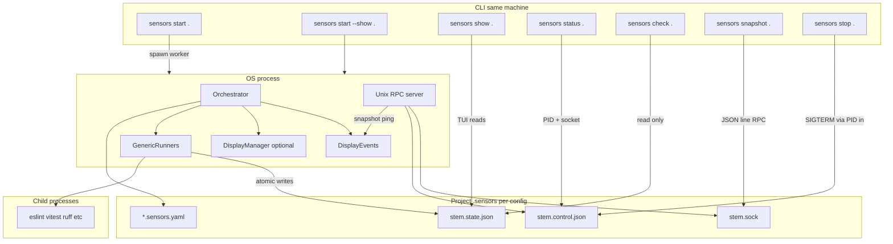

# Sensors Sidecar

An **experimental** continuous code quality monitoring system. It can run linting, tests, and other checks on a schedule or in watch mode, persists structured state under `.sensors/` in the target codebase, and exposes a **`sensors`** CLI for running the service, checking the sensor status, or displaying the status in a human readable format.

Use `/_local-setup` skill to set it up on your machine (or use the `SKILL.md` file as documentation if you want to do it manually).

## How it fits together



**Flows:**

- **`sensors start .`** — starts a **background** worker (no terminal UI). Writes `stem.control.json` (PID + socket path) and listens on **`stem.sock`** for RPCs (`ping`, `snapshot`).
- **`sensors start --show .`** — same process, but with the **live Rich table** (and keyboard: `S` snapshot, `C` clear/reload, `Q` quit).
- **`sensors show .`** — if a sensors is already running, opens an **attach** viewer in this terminal (reads the same `stem.state.json`; `Q` only exits the viewer).
- **`sensors status .`** — reports whether the sensors **process** is running (uses **`stem.control.json`**, live PID, and a **socket ping**). Exit `0` if running, `1` if not.
- **`sensors status --all`** — lists **every** **`start`** process on this machine (`--worker` or `--show`) by scanning **`/proc`** on Linux or **`ps`** elsewhere. The **project** path is the directory containing **`.sensors/`**, resolved in order: open **`.sensors/*.sock`** via **`lsof`** (same file the server binds), else **`.sensors/*.control.json`** (**`socketPath`** + **`pid`**), else process cwd / argv. On macOS, **`/private/var/...`** is shown as **`/var/...`** where equivalent.
- **`sensors check .`** — read **`stem.state.json`** and print per-runner results (no running process required for the read; you get exit `2` if nothing has written yet). Exit `0` / `1` / `2` like the old `check` command.
- **`sensors snapshot .`** — sends an RPC to the **running** process to save a **score snapshot** (same as pressing `S` in the TUI).
- **`sensors stop .`** — sends **SIGTERM** to the PID recorded in `stem.control.json` (graceful shutdown).

**Platform note:** The control plane uses **Unix domain sockets** only, only tested on MacOS.

## Features

- **Foreground or background** — `sensors start --show` for the table UI, or `sensors start` to detach.
- **Attach viewer** — `sensors show` when a sensors process is already up.
- **Dual runner modes** — watch (streaming) and interval (periodic).
- **Pluggable parsers** — ESLint, Vitest, pytest, Ruff, and more under `sensors/runners/parsers/`.
- **File-backed state** — atomic writes to `stem.state.json`; optional score **snapshots** for trend comparison.
- **Run as background process** — lightweight JSON-line RPC over a Unix socket (`ping`, `snapshot`).

## Commands

Most commands take the **project directory** (the one that contains `.sensors/`) as the first argument. Use `.` when already `cd`’d into the project. **`sensors status --all`** does not take a path.

```bash
# Is the sensors service running? (exit 0 = yes, 1 = no)
sensors status .

# All sensors start processes on this host (from /proc or ps)
sensors status --all

# Agent-optimized runner results (failures included per runner); exit 0/1/2
sensors check .

sensors check . --runner eslint

# Save a score snapshot via RPC (needs a process to be running)
sensors snapshot .
```

For **`status --all`**, the **project** column is the directory that contains **`.sensors/`** (where **`*.sock`** lives). Resolution order: **`lsof`** on the open **`.sensors/*.sock`** (the bound socket), then **`.sensors/*.control.json`** (**`socketPath`** + **`pid`**, same as **`sensors stop`**), else process **cwd** / argv. Paths under **`$HOME`** use **`~/...`**; on macOS, **`/private/var/...`** is shown as **`/var/...`** when equivalent. **`/var/folders/...`** rows are usually **pytest temp projects**; interrupted runs can leave workers behind—**`sensors stop <that project path>`** or **`kill <pid>`**.

### Example: `sensors check`

```text
$ sensors check .
SENSORS STATUS
Updated: 2026-02-14T13:40:15Z

tests: SUCCESS (6 passed, 0 failed) [ran 2s ago]

eslint: FAILURE (1 errors, 1 warnings) [ran 0s ago]
  /path/to/src/calculator.ts:2:9 ERROR @typescript-eslint/no-unused-vars ...
```

## Configuration

Place one or more `*.sensors.yaml` files under `.sensors/`. If only one exists, it is chosen automatically; otherwise pass `--config myproj.sensors.yaml`.

State and control sidecars are named from the config stem, e.g. `myproj.sensors.yaml` → `myproj.state.json`, `myproj.control.json`, `myproj.sock`.

Example:

```yaml
version: 1
runners:
  - name: eslint
    parser: eslint
    enabled: true
    mode: interval
    command: npx eslint --format json .
    interval: 5000

  - name: tests
    parser: vitest
    enabled: true
    mode: watch
    command: npx vitest --watch
```

Optional **`workingDir`** on a runner: relative path from the project root (e.g. `./ui`) if commands should not run at the repo root.

### Execution modes

- **Watch** — long-lived tool output (e.g. Vitest watch).
- **Interval** — run a command every `interval` milliseconds.

## Parsers

The project comes with a bunch of output parsers for common tools, like `eslint` or `ruff`. If you want to use a tool as a sensor that is not yet supported, you either have to add a new parser to the code (and reinstall the CLI), or you can use the default parser.

### Adding a new parser

Add a **parser** under `runners/parsers/` and register it in `runners/parsers/__init__.py`. The generic runner handles process lifecycle; see [`.claude/skills/_new-parser/SKILL.md`](/.claude/skills/_new-parser/SKILL.md) in this repo for a guided template.

## Default parser: Expected output format

Use `parser: default` in your runner config to connect any tool that can emit a JSON object in the specified schema. You have to build a script for your tool that turns the tool's output into this schema, and use that script in your sensor configuration.

### Schema

```json
{
  "findings": [
    {
      "message": "Unused variable 'x'",
      "severity": "error",
      "file": "src/foo.py",
      "line": 42,
      "column": 9,
      "rule": "F841",
      "context": "x is assigned but never used"
    }
  ],
  "metrics": [
    {
      "key": "errorCount",
      "label": "Errors",
      "value": 1,
      "direction": "less"
    }
  ],
  "guidance": [
    {
      "rule": "F841",
      "body": "Remove variable or use it."
    }
  ],
  "score": {
    "value": 1,
    "direction": "less",
    "description": "Issues reported by tool"
  },
  "success": false,
  "summary": "1 issue",
  "extra": {
    "any": "parser-specific payload"
  }
}
```

This schema mirrors the `SensorReading` model used by built-in parsers. All fields are optional; missing values are derived as follows:

| Field | If absent or null |
|---|---|
| `findings` | treated as `[]` |
| `metrics` | treated as `[]` |
| `guidance` | treated as `[]` |
| `extra` | treated as `{}` |
| `success` | `true` when `findings` is empty, `false` otherwise |
| `summary` | `"N issue(s)"` / `"No issues"` derived from findings count |
| `score.value` | `len(findings)` |
| `score.direction` | `"less"` (lower is better) |
| `score.description` | `"Issues reported by tool"` |

`success`, `summary`, and `score` can be set explicitly and are used as-is. This allows tools that do not produce per-finding rows (for example, coverage checks) to report a score directly.


### Example config

```yaml
runners:
  - name: my-custom-check
    parser: default
    enabled: true
    mode: interval
    command: some-tool | ./scripts/to-parser-default-format.sh
    interval: 10000
```

### Minimal valid output

A tool that only reports a count without individual violations:

```json
{"success": false, "summary": "Coverage 72% (threshold 80%)", "score": {"value": 72, "direction": "more"}}
```

A tool with no issues:

```json
{"findings": []}
```

## Testing

```bash
uv run pytest tests/ -v
```

