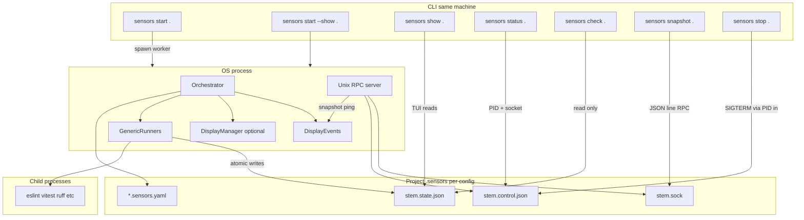
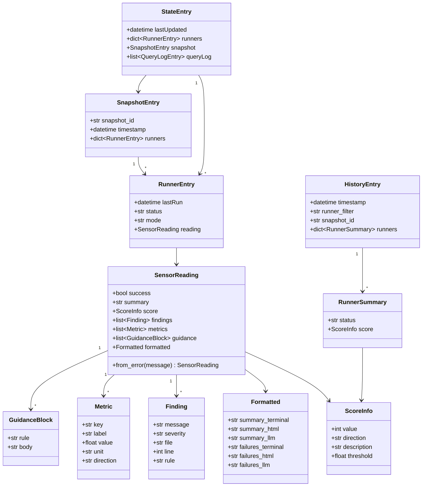
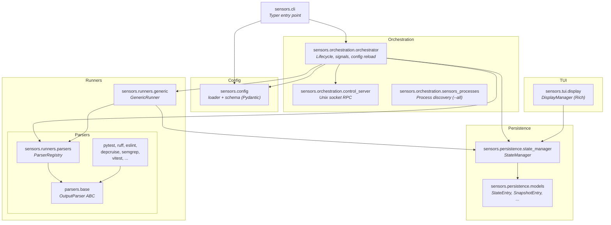

# Sensors Sidecar Architecture

## How it fits together

**Flows:**

- **`sensors start .`** — starts a **background** worker (no terminal UI). Writes `stem.control.json` (PID + socket path) and listens on **`stem.sock`** for RPCs (`ping`, `snapshot`).
- **`sensors start --show .`** — same process, but with the **live Rich table** (and keyboard: `S` snapshot, `C` clear/reload, `Q` quit).
- **`sensors show .`** — if a sensors is already running, opens an **attach** viewer in this terminal (reads the same `stem.state.json`; `Q` only exits the viewer).
- **`sensors status .`** — reports whether the sensors **process** is running (uses **`stem.control.json`**, live PID, and a **socket ping**). Exit `0` if running, `1` if not.
- **`sensors status --all`** — lists **every** **`start`** process on this machine (`--worker` or `--show`) by scanning **`/proc`** on Linux or **`ps`** elsewhere. The **project** path is the directory containing **`.sensors/`**, resolved in order: open **`.sensors/*.sock`** via **`lsof`** (same file the server binds), else **`.sensors/*.control.json`** (**`socketPath`** + **`pid`**), else process cwd / argv. On macOS, **`/private/var/...`** is shown as **`/var/...`** where equivalent.
- **`sensors check .`** — read **`stem.state.json`** and print per-runner results (no running process required for the read; you get exit `2` if nothing has written yet). Exit `0` / `1` / `2` like the old `check` command.
- **`sensors snapshot .`** — sends an RPC to the **running** process to save a **score snapshot** (same as pressing `S` in the TUI).
- **`sensors stop .`** — sends **SIGTERM** to the PID recorded in `stem.control.json` (graceful shutdown).

## Domain Model

## Module Layers

