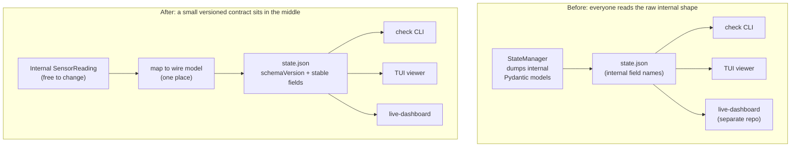
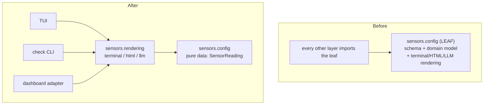
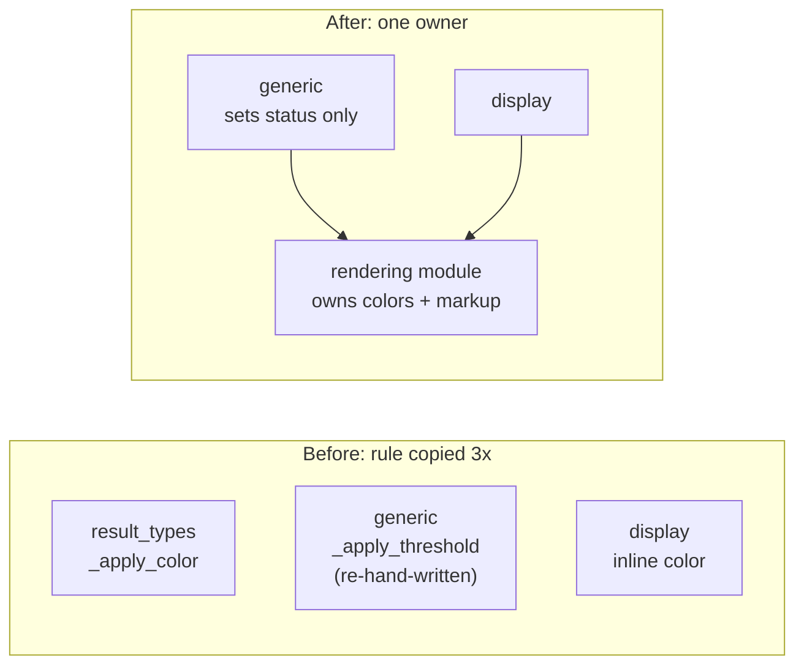
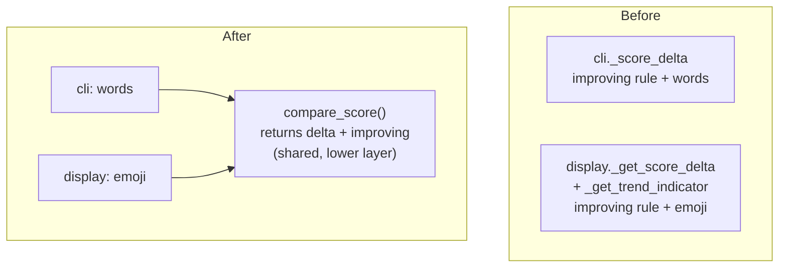
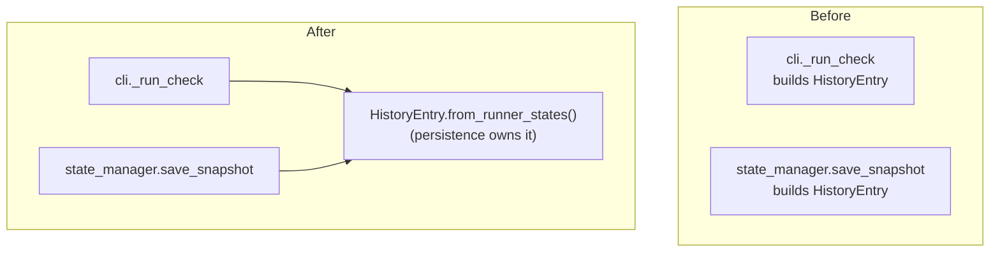

# Modularity Review — Sensors CLI

**Scope**: Entire `sensors/` Python package (CLI, orchestration, runners/parsers, persistence, config, TUI)
**Date**: 2026-06-15 (UTC)
**Model used**: [Balanced Coupling](https://coupling.dev/posts/core-concepts/balance/) by Vlad Khononov

---

## How to read this report (for newer engineers)

This review uses one core idea: **[coupling](https://coupling.dev/posts/core-concepts/coupling/) is not automatically bad.** Two pieces of code are "coupled" when one needs to know something about the other. You *want* some of that — it's what makes a program do something useful. The goal is not zero coupling; it's **balanced** coupling.

We judge each connection on three things:

| Dimension | Plain-language meaning | Question it answers |
|---|---|---|
| **[Integration Strength](https://coupling.dev/posts/dimensions-of-coupling/integration-strength/)** | *How much* one component knows about another | If B changes, how likely is A to break? |
| **[Distance](https://coupling.dev/posts/dimensions-of-coupling/distance/)** | How far apart they live (same function? different files? different processes? different repos/teams?) | If they must change together, *how expensive* is that? |
| **[Volatility](https://coupling.dev/posts/dimensions-of-coupling/volatility/)** | How often this area actually changes | Does any of this *matter* in practice? |

The rule of thumb (the **[balance rule](https://coupling.dev/posts/core-concepts/balance/)**):

> **Modularity = Strength XOR Distance.** A connection is healthy when *one* of strength/distance is high and the *other* is low. It becomes a problem when **both are high** (lots of shared knowledge spread far apart) — *and* the area changes often.

Strength has four levels, from worst to best:

- **[Intrusive](https://coupling.dev/posts/dimensions-of-coupling/integration-strength/)** — reaching into another component's private internals (worst).
- **[Functional](https://coupling.dev/posts/dimensions-of-coupling/integration-strength/)** — two places implement the *same rule* and must change together (e.g. copy-pasted logic).
- **[Model](https://coupling.dev/posts/dimensions-of-coupling/integration-strength/)** — sharing a data shape / domain model.
- **[Contract](https://coupling.dev/posts/dimensions-of-coupling/integration-strength/)** — talking through a deliberate, stable, documented interface (best).

A quick word on **volatility** using terms from domain-driven design (don't worry if they're new):

- **Core subdomain** — the part that makes the product special; you change it constantly. *High volatility.*
- **Supporting subdomain** — necessary plumbing, but boring and stable. *Low volatility.*
- **Generic subdomain** — a solved problem you plug in (e.g. talking to `eslint`). *Low functional volatility.*

---

## Executive summary

The Sensors CLI runs code-quality tools (linters, tests, coverage) on a schedule, stores a structured "reading" of the results under `.sensors/`, and lets a coding agent (or a human) ask "how healthy is this codebase right now?". The architecture is **deliberately layered** (there's an `.importlinter` contract and an `ARCHITECTURE.md`), and the **parser plugin design is genuinely good** — each tool parser is small, self-contained, knows nothing about presentation, and depends only on a shared result type. That is textbook balanced coupling and should be preserved.

The modularity problems are **not** in the parser layer. They cluster around one theme: **knowledge that should be hidden behind a contract is instead spread across many components and, in places, across process and repository boundaries.** The single most important finding is that the on-disk state file (`*.state.json`) is an **unversioned, implicit contract** read by three separate consumers — including a separate `live-dashboard` project — yet its "schema" is just the raw shape of internal Pydantic objects. The codebase already contains migration code that proves this shape has changed and broken readers before. Because the project is explicitly **experimental** (high volatility everywhere), these imbalances are felt now, not in some hypothetical future.

> **Assumptions** (the two clarifying questions were declined, so these are stated explicitly and drive the severity ratings):
> 1. **Volatility is high.** The README calls the project "experimental"; the reading shape, parser set, and output formats are all actively evolving.
> 2. **The `live-dashboard` is a genuinely separate consumer** (separate project, possibly separate repo/lifecycle), based on the README and the `_local-setup` skill. The `summary_html` / `failures_html` fields exist specifically to feed it.
> If either assumption is wrong (e.g. the dashboard is aspirational, or the schema is actually frozen), downgrade Issue 1 and Issue 2 accordingly — low volatility neutralizes unbalanced coupling.

---

## Coupling overview

| Integration | [Strength](https://coupling.dev/posts/dimensions-of-coupling/integration-strength/) | [Distance](https://coupling.dev/posts/dimensions-of-coupling/distance/) | [Volatility](https://coupling.dev/posts/dimensions-of-coupling/volatility/) | [Balanced?](https://coupling.dev/posts/core-concepts/balance/) |
|---|---|---|---|---|
| Parser plugins → `SensorReading`/`Finding` types | [Contract](https://coupling.dev/posts/dimensions-of-coupling/integration-strength/) (return typed objects) | Low (same package) | High | ✅ **Yes** — model textbook |
| Orchestrator → GenericRunner → StateManager | [Contract](https://coupling.dev/posts/dimensions-of-coupling/integration-strength/)/Model | Low (same process) | Medium | ✅ Yes |
| Producer process → **state file** → `check` CLI + TUI + **external dashboard** | [Model](https://coupling.dev/posts/dimensions-of-coupling/integration-strength/), leaning [Intrusive](https://coupling.dev/posts/dimensions-of-coupling/integration-strength/) (raw internal field names) | **High** (separate processes + separate repo/system) | **High** | ❌ **No** — Critical |
| `SensorReading` domain model ↔ terminal/HTML/LLM rendering (in the `config` leaf) | [Functional](https://coupling.dev/posts/dimensions-of-coupling/integration-strength/) (presentation rules in the model) | Medium (the leaf everything imports) | High | ❌ No — Significant |
| Threshold formatting (`generic.py`) ↔ rendering (`result_types.py`) ↔ TUI (`display.py`) | [Functional](https://coupling.dev/posts/dimensions-of-coupling/integration-strength/) (duplicated markup rules) | High (3 different layers) | High | ❌ No — Significant |
| Score-trend logic in `cli.py` ↔ `display.py` | [Functional](https://coupling.dev/posts/dimensions-of-coupling/integration-strength/) (duplicated rule) | High (peers: CLI ↔ TUI) | High | ❌ No — Significant |
| History-record building in `cli.py` ↔ `state_manager.py` | [Functional](https://coupling.dev/posts/dimensions-of-coupling/integration-strength/) (duplicated rule) | High (top layer ↔ persistence) | Medium | ❌ No — Significant |
| `sensors_processes.py` ↔ file-naming/control-file conventions | [Functional](https://coupling.dev/posts/dimensions-of-coupling/integration-strength/)/[Intrusive](https://coupling.dev/posts/dimensions-of-coupling/integration-strength/) (re-encodes naming + JSON keys) | Medium | Low/Medium | ⚠️ Minor |

The next sections detail each ❌ / ⚠️ row.

---

## Issue 1: The state file is an unversioned contract shared across processes and a separate project

**Integration**: Sensors worker process (writer) → `*.state.json` → `sensors check`, TUI viewer, and external `live-dashboard` (readers)
**Severity**: **Critical**

### Knowledge Leakage

The state file is written in `StateManager._write_state_atomic` (`sensors/persistence/state_manager.py:246`) by simply serializing internal Pydantic models with `state.model_dump(mode="json")`. That means the file's "schema" is literally the internal field layout of `StateEntry` → `RunnerEntry` → `SensorReading` → `Formatted` (e.g. `reading`, `formatted`, `summary_html`, `score.direction`).

Three different readers then depend on that raw shape:

1. **`sensors check`** (`sensors/cli.py:316`) — a *separate process invocation*.
2. **The TUI viewer** (`sensors/tui/display.py:268`, reads `reading.formatted.summary_terminal`) — usually a *separate process* attached via `sensors show`.
3. **The `live-dashboard` project** — a *separate codebase* that reads the `summary_html` / `failures_html` fields (these fields exist for no other reason).

None of these readers go through a published, versioned interface. They each parse internal field names directly. In Balanced Coupling terms this is **[model coupling](https://coupling.dev/posts/dimensions-of-coupling/integration-strength/) shading into [intrusive coupling](https://coupling.dev/posts/dimensions-of-coupling/integration-strength/)** — outsiders depend on what should be private implementation detail.

The smoking gun that this is already painful: `state_manager.py:37-45` contains **backwards-compatibility migration code** that rewrites an *old* on-disk format (top-level `formatted` + `score`) into the *new* `reading` shape. Migration code only exists because the shape changed and broke readers.

### Complexity Impact

This is the classic recipe for a **[distributed monolith](https://coupling.dev/posts/core-concepts/balance/)**: high shared knowledge spread across a high [distance](https://coupling.dev/posts/dimensions-of-coupling/distance/) (separate processes, separate repos). When you rename or restructure a field in `SensorReading`, the *Python type checker says everything is fine* — because the breakage is in a different process, or a different repository, that the compiler never sees. The outcome of a change becomes **unpredictable**: you cannot tell, from the code in front of you, who you just broke. That is the definition of [complexity](https://coupling.dev/posts/core-concepts/complexity/) — exceeding the "4±1 things I can hold in my head," because the affected things aren't even in this codebase.

### Cascading Changes

- Rename `summary_llm` → `agent_summary`: silently breaks the dashboard's HTML rendering and possibly `check` output, with no compile-time error.
- Move `score` from inside `reading` to the top level: breaks all three readers; you'd add *yet another* migration branch in `_hydrate_runner_states`.
- Add a new audience (say, a Slack bot): there's no contract to code against, so it copies field-name assumptions too, increasing the blast radius of the next change.

### Recommended Improvement

Introduce an explicit **integration [contract](https://coupling.dev/posts/dimensions-of-coupling/integration-strength/)** for the state file so readers stop depending on internal layout. Concretely:

1. **Add a `schemaVersion` field** to the top of the state file. Readers check it and fail loudly (not silently) on mismatch.
2. **Define a thin published "wire" model** (a [Data Transfer Object / published language](https://coupling.dev/posts/dimensions-of-coupling/integration-strength/)) that is deliberately separate from the internal `SensorReading`. Serialize to *that*, not to the internal model directly. The internal model can then change freely as long as the mapping to the wire model is updated in one place.
3. **Document the wire schema** in `docs/` and treat changes to it as deliberate, versioned events.

This **reduces strength** (readers now know a small stable contract, not the whole internal model) without changing distance — exactly the move the balance rule recommends when distance is unavoidably high.

**Trade-off**: you add one mapping layer and must keep it in sync — a small, *local* cost. In exchange, the internal model becomes free to evolve, and a schema change becomes a deliberate, visible act instead of a silent break in another repo. Worthwhile precisely because volatility here is high.

---

## Issue 2: Presentation knowledge lives inside the shared domain model and the leaf layer

**Integration**: `SensorReading` domain model ↔ terminal/HTML/LLM rendering, both inside `sensors/config`
**Severity**: **Significant**

### Knowledge Leakage

`sensors/config` is declared the **leaf layer** in `.importlinter` — the lowest layer, which *everything else imports*. It is supposed to hold configuration schema and shared types. But `result_types.py` also contains the entire **rendering engine**: `_apply_color` (`result_types.py:183`) emits Rich terminal markup like `[red]...[/red]`, `_render_finding_html` emits ``, and `_summary`/`_failures` build the LLM-facing plain text. A `@model_validator` on `SensorReading` (`result_types.py:151`) runs this rendering automatically at construction time.

So the domain model doesn't just *describe* a reading — it knows how to **paint that reading for three different audiences** (terminal, web, agent). That is presentation knowledge ([functional coupling](https://coupling.dev/posts/dimensions-of-coupling/integration-strength/)) baked into the most-depended-on module in the system. This is also a **cohesion** problem: the leaf now changes for three unrelated reasons (config rules, domain shape, *and* how things look on a terminal vs a webpage).

### Complexity Impact

Because the leaf is imported by everyone, a change to "how a warning looks in HTML" touches the foundation that the whole dependency graph rests on. New engineers reasonably assume "config" is safe, low-level, presentation-free — and are surprised to find CSS class names there. Surprise is the hallmark of [complexity](https://coupling.dev/posts/core-concepts/complexity/): the place you change and the place that's affected don't line up with the mental model the layering advertises.

### Cascading Changes

- The dashboard restyles and wants different HTML class names → you edit the *config leaf*.
- You add a fourth audience (e.g. JSON for an API) → you must widen the `Formatted` model and the leaf's rendering functions, forcing a recompile/redeploy of literally everything downstream.
- The producer must compute *all three* renderings eagerly at write time, even for audiences that may never read this particular reading.

### Recommended Improvement

Move rendering **out of the leaf and out of the domain model** into a dedicated presentation module (e.g. `sensors/rendering/`) that *depends on* the model rather than living inside it. Keep `SensorReading` as pure data (`findings`, `metrics`, `score`, `summary`). Let each consumer (TUI, dashboard adapter, agent/`check` output) ask the renderer for the format it needs.

**Trade-off**: consumers now make an explicit "render this" call instead of reading a pre-baked string. That is a small amount of extra wiring, but it restores the leaf to a single clear responsibility and means presentation can change without disturbing the foundation. (This pairs naturally with Issue 1 — the dashboard's HTML can move behind the wire contract.)

---

## Issue 3: The terminal/HTML markup convention is duplicated across three layers

**Integration**: `result_types.py` (`_apply_color`) ↔ `generic.py` (`_apply_threshold`) ↔ `display.py`
**Severity**: **Significant**

### Knowledge Leakage

The *rule* for "how do we colour text" is implemented in at least three different layers that don't import each other:

- **`result_types.py:183`** — `_apply_color` is the canonical version: terminal `[{color}]…[/{color}]`, HTML ``.
- **`generic.py:155-165`** (the **runners** layer) — `_apply_threshold` re-hand-writes the exact same conventions: `f"[yellow]{summary} ({note})[/yellow]"` and `'…'`.
- **`display.py:272-273`** (the **TUI** layer) — builds `f"{details} [{color}]{delta_str}[/{color}]"` with its own `"green"`/`"red"` choice, plus status icons and trend emojis.

This is **implicit [functional coupling](https://coupling.dev/posts/dimensions-of-coupling/integration-strength/)**: three copies of one rule, with nothing linking them. The "below threshold = yellow / `sensors-warn`" decision is duplicated knowledge across a **high [distance](https://coupling.dev/posts/dimensions-of-coupling/distance/)** (config leaf, runners, TUI are three different architectural layers).

### Complexity Impact

When the same rule lives in three unlinked places, changing it correctly requires you to *remember all three exist* — and nothing in the code tells you they do. You'll fix two and miss one, and the bug surfaces only in whichever output path you didn't test. This is exactly the "outcome of a change is unpredictable" situation modularity is meant to prevent.

### Cascading Changes

- Rebrand the HTML classes (`sensors-warn` → `quality-warn`): you must find and edit `result_types.py` *and* `generic.py`; miss the runner copy and "below threshold" rows render with a stale class only in that one case.
- Switch terminal colour scheme: `result_types.py`, `generic.py`, and `display.py` all need synchronized edits.

### Recommended Improvement

This is the *same root cause* as Issue 2 and resolves with the same move: a single presentation module owns the colour/markup vocabulary, and `generic.py`'s threshold path and `display.py` both call into it instead of hand-writing markup. The runner shouldn't be formatting strings at all — it should set a status/flag and let the renderer decide the colour.

**Trade-off**: minimal — mostly deletion of duplicated string-building. The main discipline is keeping the runner out of the formatting business.

---

## Issue 4: Score-trend ("better/worse than snapshot") logic is duplicated between the CLI and the TUI

**Integration**: `cli.py` (`_score_delta`) ↔ `display.py` (`_get_score_delta` + `_get_trend_indicator`)
**Severity**: **Significant**

### Knowledge Leakage

Comparing the current score to the saved snapshot — including the subtle "which direction counts as *improving*" rule — is implemented twice:

- **`cli.py:105`** `_score_delta`: computes `diff = cur - snap` and `improving = (diff < 0 and direction == "less") or (diff > 0 and direction == "more")`, then renders `"Better than snapshot (+N)"`.
- **`display.py:212`** `_get_score_delta` and **`display.py:171`** `_get_trend_indicator`: compute the *identical* `improving` rule, then render `(+N)` plus a 🚀/🔺 trend emoji.

Same domain rule, two copies, living in **peer layers** (`cli` and `tui` are siblings that, per the `.importlinter` contract, must not import each other). That makes the [distance](https://coupling.dev/posts/dimensions-of-coupling/distance/) genuinely high — there is deliberately no shared path between them today.

### Complexity Impact

"Improving" is a real piece of domain logic (it depends on whether lower-is-better or higher-is-better). Two definitions of the same concept can silently *drift apart*: a fix to the edge cases in one (e.g. how ties or missing snapshots are handled) won't reach the other, so the CLI and the live display can disagree about whether the codebase is getting better. Disagreeing answers to "is this improving?" is worse than a crash, because nobody notices.

### Cascading Changes

- Add a "no meaningful change within ±2" tolerance band → must be added in both places or the TUI and `check` will report different trends.
- Introduce a new score direction or a percentage-delta → duplicated again.

### Recommended Improvement

Extract the comparison into a single small domain helper (e.g. `ScoreComparison.compare(current, snapshot) -> {delta, improving}`) placed in a layer both peers may import — the `persistence`/`config` model area, where `ScoreInfo` already lives. Both `cli.py` and `display.py` call it; each keeps only its *own presentation* (the CLI prints words, the TUI picks an emoji). This **reduces strength** (one rule, one place) while respecting the peer boundary.

**Trade-off**: one new tiny function and two call sites updated. The presentation stays where it belongs; only the *rule* is centralized.

---

## Issue 5: History-record construction is duplicated between the CLI and the persistence layer

**Integration**: `cli.py` (`_run_check`) ↔ `state_manager.py` (`save_snapshot`)
**Severity**: **Significant**

### Knowledge Leakage

Building a `HistoryEntry` / `HistoryRunnerEntry` from the live runner states — the exact mapping of `status`, the `{"value", "direction"}` score dict, and `findings` — appears in two places:

- **`cli.py:359-378`** inside `_run_check`.
- **`state_manager.py:163-183`** inside `save_snapshot`.

The two comprehensions are nearly identical. This is [functional coupling](https://coupling.dev/posts/dimensions-of-coupling/integration-strength/): the **top layer (`cli`) reaches down and re-implements a persistence record** that the **persistence layer** also knows how to build. It also mildly inverts the intended layering — the CLI is doing persistence-shaped work that the persistence module should own.

### Complexity Impact

The history record's shape is now defined in two layers that sit far apart. A change to what a history row contains (say, adding a `durationMs`) must be mirrored, or the history file ends up with two slightly different row formats depending on whether the row came from a `check` or a `snapshot`. Anyone analyzing `history.jsonl` later then has to handle both — complexity leaking downstream to a future reader.

### Cascading Changes

- Add a field to history rows → edit both `cli.py` and `state_manager.py`.
- Change how `score` is compacted → two edits, easy to half-miss.

### Recommended Improvement

Give the persistence layer one factory — e.g. `HistoryEntry.from_runner_states(runners, *, timestamp, runner_filter, snapshot_id)` (or a `StateManager` helper) — and have **both** `cli._run_check` and `state_manager.save_snapshot` call it. The knowledge of "how a runner state becomes a history row" then lives once, in the layer that owns history.

**Trade-off**: trivial — one shared constructor, two call sites. Pure win given the duplication already exists.

---

## Issue 6: Process discovery re-encodes the file-naming and control-file contract

**Integration**: `sensors_processes.py` ↔ the file-naming conventions defined in `config/loader.py` and the control-file shape written by `control_server.py`
**Severity**: **Minor**

### Knowledge Leakage

The canonical knowledge of *how sidecar files are named* lives in `config/loader.py` (`socket_path_for_config` → `*.sock`, `control_path_for_config` → `*.control.json`, the `.sensors/` directory name). But `sensors_processes.py` re-encodes the same conventions as string/pattern knowledge: it scans for sockets matching `/.sensors/*.sock`, globs `*.control.json`, and reads control-file keys (`pid`, `socketPath`, `workingDir`) by hand. `control_server.py` writes those same keys (`write_control_file`). So the "shape of a control file" and "what our files are named" is known in two-to-three places that don't share a definition.

### Complexity Impact

This is lower-stakes because the area is **less volatile** (file-layout plumbing is supporting-subdomain work that rarely changes) and the distance is moderate (all within the package). But it is still implicit [functional coupling](https://coupling.dev/posts/dimensions-of-coupling/integration-strength/): rename the suffix or add a control-file field, and discovery can quietly stop finding processes — a confusing, hard-to-trace failure for `sensors status --all`.

### Cascading Changes

- Change `.sock` → `.socket`, or `.control.json` naming → update `loader.py` *and* the patterns in `sensors_processes.py`.
- Add a required control-file field → `control_server.py` writes it; `sensors_processes.py` and `control_server.control_state` readers must agree on it.

### Recommended Improvement

Centralize the conventions: a single source for the suffixes/dir name (extend the existing `*_path_for_config` helpers, or a small constants module) and a single typed accessor for the control file (a `ControlFile` model with `read`/`write`) that both `control_server.py` and `sensors_processes.py` use. This turns an implicit convention into an explicit [contract](https://coupling.dev/posts/dimensions-of-coupling/integration-strength/).

**Trade-off**: small refactor; mostly replacing string literals with shared helpers. Address opportunistically — it's real but not urgent given low volatility here.

---

## What is already healthy (keep doing this)

- **Parser plugins are a model of balanced coupling.** Every parser (`ruff.py`, `eslint.py`, `pytest.py`, …) imports only the shared result types and the `OutputParser` base, returns typed `Finding`/`Metric`/`ScoreInfo` objects, and contains **zero** presentation knowledge. New tools plug in without touching anything else. High volatility (you add parsers often) is balanced by low strength (a clean [contract](https://coupling.dev/posts/dimensions-of-coupling/integration-strength/)) — this is [loose coupling done right](https://coupling.dev/posts/core-concepts/balance/). The minor duplication between parsers (pluralizing "N issue(s)", stripping preamble before JSON) is cosmetic; a small shared helper on the base class would be a nice-to-have, not a modularity risk.
- **The layered `.importlinter` contract and `ARCHITECTURE.md`** make intended boundaries explicit and enforceable — a real strength. The findings above are mostly cases where *runtime* knowledge-sharing slips past what the static layer contract can see (duplicated rules, the on-disk file format).
- **Atomic state writes** (`tempfile` + `os.replace`) correctly manage the producer/consumer hand-off at the file boundary.

---

## Priority order

| # | Issue | Severity | Why this order |
|---|---|---|---|
| 1 | State file = unversioned cross-system contract | **Critical** | Highest strength × distance × volatility; already breaking readers (migration code exists). |
| 2 | Presentation logic in the domain model / leaf layer | Significant | Root cause feeding Issues 1 & 3; touches the most-imported module. |
| 3 | Markup convention duplicated across 3 layers | Significant | Same fix as #2; resolves together. |
| 4 | Score-trend logic duplicated CLI ↔ TUI | Significant | Can cause *disagreeing* answers; cheap to fix. |
| 5 | History-record construction duplicated CLI ↔ persistence | Significant | Cheap, pure-win deduplication. |
| 6 | Process discovery re-encodes file conventions | Minor | Low volatility; address opportunistically. |

A natural first sprint: do **Issues 2 + 3 together** (create the rendering module), which then makes **Issue 1** straightforward (the dashboard reads a wire model instead of internal HTML fields). Issues 4 and 5 are small, independent, high-value cleanups that can land anytime.

---

_This analysis was performed using the [Balanced Coupling](https://coupling.dev) model by [Vlad Khononov](https://vladikk.com)._
